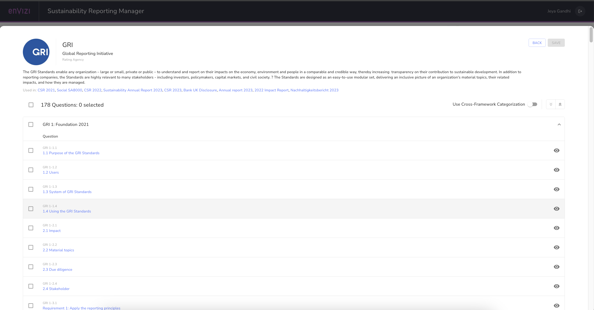
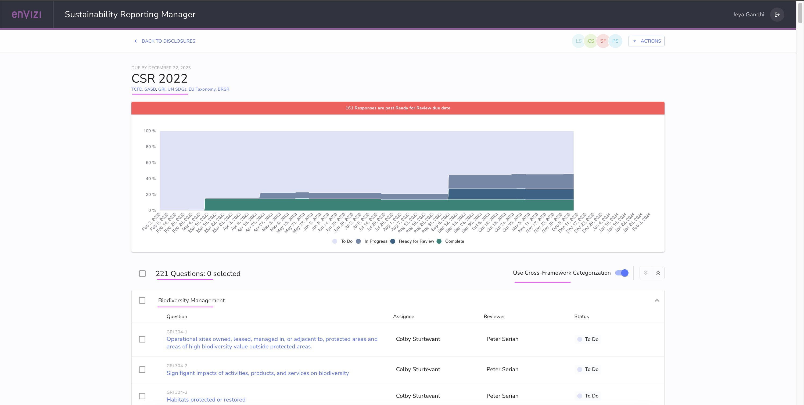
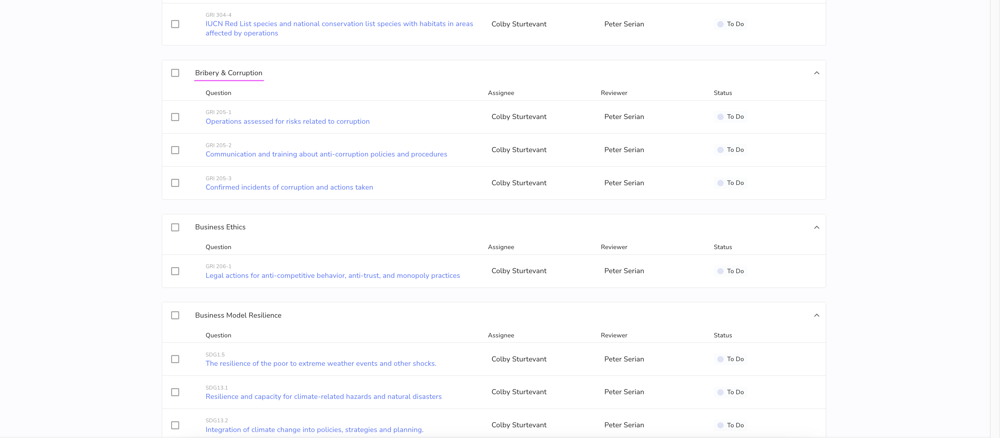
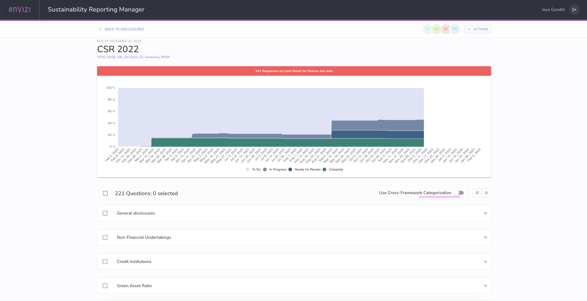
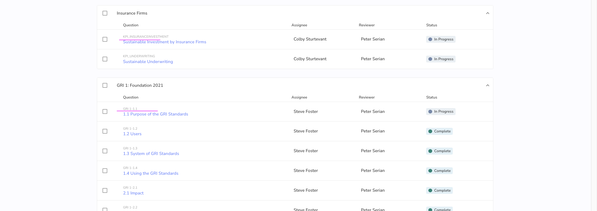
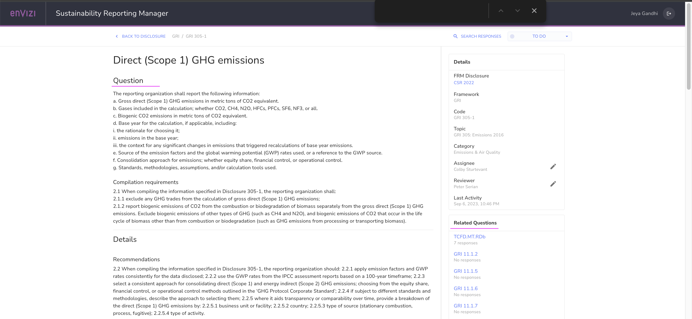
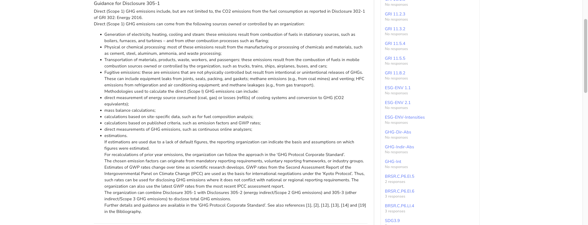
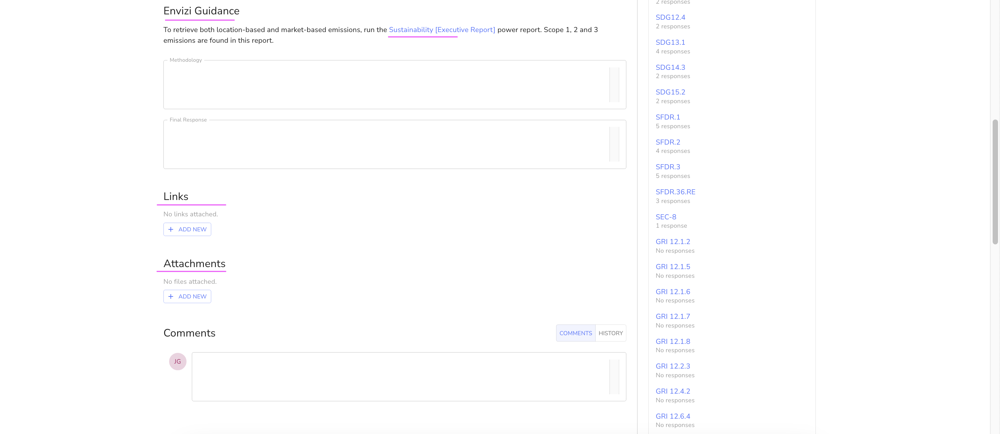

# ESG Reporting frameworks and Envizi

ESG frameworks are used by organizations for the purpose of publicly reporting detailed environmental, social and governance (ESG) metrics of the business. 

In this article lets us explore about the different ESG reporting frameworks available and how organization needs to choose the appropriate frameworks for their reporting. Also lets explore how the disclosers are done in Envizi by choosing the frameworks.

## Introduction

Companies uses ESG reporting frameworks to disclose data covering their business operations, and opportunities and risks related to environmental, social, and governance (ESG) aspects. These frameworks are developed by diverse entities like NGOs, stock exchanges, business groups, non-profits, think tanks, and governments. Despite the existence of numerous ESG frameworks, only around a dozen are deemed significant. Each framework generally establishes the metrics, qualitative elements, format, and reporting frequency for companies. While some frameworks are voluntary, others are mandated by governments.

In response to rising `investor and community interest`, organizations are targeting sustainability performance improvements, setting ESG goals and reporting on their performance. `Failure` to take ESG risks seriously could result in many `negative impacts for firms`.  The increasing importance of ESG means that organizations are reporting their ESG impact using an ever-increasing range of different frameworks.

## 1. ESG Frameworks

Let us explore the ESG frameworks landscape and framework coverage.

### Framework landscape

The ESG frameworks landscape can be subdivided into the following 5 categories.

#### Global Agreements
A legally-binding commitment between entities to achieve a specific set of outcomes of global importance, typically facilitated through diplomacy.

#### International Frameworks
Structures developed by independent organizations enabling corporations and financial institutions to categorize, share, and communicate information

#### Corporate Reporting Standards
A set of uniform criteria for entities to report against, harmonizing disclosures across a given industry or set of industries

#### Market Regulations
A regulation with significant implications for activities across a macroeconomic landscape, driving a paradigm shift

#### Domestic Legislation
A national or state law, funding package, or executive order directing local activities

### Framework Coverage

Each of the major ESG reporting frameworks has different levels of focus on the key ESG performance metrics. This matrix illustrates the focus areas for each reporting framework.

## 2. Selecting ESG reporting frameworks

The ESG reporting landscape is cluttered with a large number and variety of reporting frameworks. Applying different lenses to assess and categorize the various frameworks can help selecting the appropriate ESG reporting frameworks for your organization.

#### 2.1 Lens 1: Potential for impact

The decision should start by considering where an organization can make the most difference based on materiality assessments. The materiality guides organizations to focus on ESG issues that are relevant to them and will have a measurable impact on their business.

For example, a large-cap e-commerce company may choose to focus on packaging materials and waste (environmental), supply chain labor standards (social) and business ethics (governance) in its materiality assessment 

#### 2.2 Lens 2: Stakeholder expectations

Organizations may also consider what their stakeholders are looking for and which ESG frameworks these stakeholders expect to be used. For example,

- Investors, boards, insurers and creditors may prefer 
  - Task Force on Climate-related Financial Disclosures (TCFD) or 
  - Sustainability Accounting Standards Board (SASB). 
- Employees and consumers
  - United Nations Sustainable Development Goals (UN SDGs)
- Governments or regulators may prefer 
  - Streamlined Energy and Carbon Reporting (SECR)
  - National Greenhouse and Energy Reporting (NGER)

#### 2.3 Lens 3: Geography

Certain ESG reporting frameworks are only relevant in particular geographies. (mandated by law, specific to local conditions).
- ENERGY STAR (North America and select other countries)
- SECR (UK) and NGER (Australia)

#### 2.4 Lens 4: Sector preference

Organizations within specific sectors naturally align with particular ESG reporting frameworks. For instance, the Global Real Estate Sustainability Benchmark (GRESB) is used to assess the sustainability performance of real estate and infrastructure portfolios.

#### 2.5 Lens 5: Framework coverage

Each ESG reporting frameworks has different levels of focus on the key ESG performance metrics such as environment, social, governance, carbon, energy, waste and wate., Understanding which framework focuses
on which indicator can help with framework.

## 3. Adopt a dedicated ESG reporting system - Envizi

The spreadsheets approaches are not an efficient means of managing ESG data in the face of stakeholder and regulatory pressure, especially for complex global organizations reporting to multiple frameworks.

Organizations have dedicated IT systems for process support and security, dedicated accounting systems to safeguard financial data, and HR systems to handle personnel information. Similarly, ESG reporting requires dedicated attention. Employing a specialized software platform can significantly benefit organizations in capturing activity data, calculating emissions, overseeing sustainability initiatives, and managing supply chain information, all contributing to robust ESG reporting. This becomes particularly crucial for the "E" (environmental) aspect of ESG, known for its complexity in reporting and tracking.

ESG reporting software such as the IBM Envizi ESG Suite can help you stay organized by automating data capture directly from the source and maintaining. The IBM solution simplifies  your ESG reporting to different frameworks. All your responses across multiple internationally recognized frameworks, such as SASB and GRI, are available in a framework library with one data set and one repository of information.

## 4. ESG Frameworks in Envizi

The Sustainability Reporting Manager (SRM) in Envizi helps organizations to capture, manage and report ESG quantitative metrics and questionnaire responses across many different ESG Frameworks.

This is the main page of the SRM tool, displaying the various disclosures prepared and ready for submission.

#### Framework library

Here is the Framework library of major ESG frameworks in SRM. 

Click on [this](https://knowledgebase.envizi.com/home/srm-supported-framework) to know more about this.

#### Custom frameworks

Users can create custom frameworks in SRM. This screen shows the list custom frameworks created in this organization.

####  Framework questions

This screen shows the list of questions available in a framework

#### Disclosure in Detail

Lets us see the disclosure in detail.

The below picture shows the disclosure `CSR 2022`.
- It contains the questionaries from several ESG frameworks such as `TCFD, SASB, GRI, UN SDGs, EU Taxonomy, BRSR`
- Questiones are categaorized across the Framework as the `Use Cross-Framegework Categorization` option is checked.

- Questiones are categaorized based on the Framework as the `Use Cross-Framegework Categorization` option is un-checked.

Here is the question details. 
- It contains Question and question details.
- It contains Envizi Guidance to fill the answers to the question. The Sustainability [Executive Report] link is available to view and prepare the response.
- The related questions section is available to show the similar questions available from other frameworks as well.
- While you give a response, you can also able to provide supporting links and attachments.

## 5. Frameworks in Detail

Here is an overview of sustainability performance indicators used in each ESG framework. 

The major ESG reporting frameworks are grouped into four categories:

- Benchmark frameworks
	- CDP, GRESB ESG frameworks
- Voluntary frameworks
	- GRI, TCFD, VRF (SASB + IIRC)
- Regulatory frameworks
	- SFDR, NGER, SECR
- Rating agencies
	- ENERGY STAR, DJSI (CSA), NABERS

### 5.1 Benchmark frameworks

These require responses to all questions in the framework and typically have a scoring element.

#### 5.1.1 Carbon Disclosure Project (CDP)

CDP frameworks helps the companies to provide the stakeholders with the below `environmental information`.
- environmental governance and policy
- risks and opportunity management
- environmental targets and strategy
- scenario analysis

The stakeholders are investors, employees and customers.

CDP offers three questionnaires on the topics of `climate change, water and forests`.

#### 5.1.2 Global Real Estate Sustainability Benchmark (GRESB)

GRESB helps to assess the sustainability performance of `real estate` and `infrastructure portfolios and assets`.

The stakeholders are investors and asset managers.

GRESB provides `material insights` into the sustainability performance of a company’s real assets. 

These insights are aligned with international reporting frameworks such as the `GRI` and Principles for Responsible
Investment `(PRI)`. 

Assessment participants receive the 
  - Comparative business intelligence on where they stand against their peers
  - A roadmap with actions they can take to improve their ESG performance 
  - A communication platform to engage with investors 
  
Investors use these to improve the sustainability performance of their investment portfolios.

### 5.2 Voluntary frameworks

These allow reporters to select the questions they want to report against, depending on factors such as their industry of operation and their materiality. Scoring is typically not included in these frameworks.

#### 5.2.1 Global Reporting Initiative (GRI) 
GRI is a globally applicable and most widely used reporting standard. It is designed to prepare a sustainability report focused on `material` topics. It is available in three sets:

#### Universal Standards: 
The Universal Standards applies to all organizations. It contains the three standards.
- GRI 1, Foundation
- GRI 2, General Disclosures
- GRI 3, Material Topics

#### Sector Standards: 
Specific standards are available across 40 sectors. Here are the 4 groups available for sectors.
- Group 1: Basic Materials and Needs
- Group 2: Industrial
- Group 3: Transport, Infrastructure, and Tourism
- Group 4: Other Services and Light Manufacturing

#### Topic Standards
Specific standards across 33 topics. They belongs to `Environmental, Social, Governance` and  other topics.

#### 5.2.2 Task Force on Climate-related Financial Disclosures (TCFD)

TCFD is explicitly designed to address `climate-related` financial risks of the business to investors, lenders and insurers, falling within the ‘E’ of ESG reporting. 

TCFD is made of 11 disclosures and divided into 4 pillars.

- **Governance** : Te organization’s governance around climate-related risks and opportunities?
- **Strategy**: The actual and potential impacts of the climate-related risks and opportunities on the organization's businesses, strategy and financial planning.
- **Risk Management:** The process used by the organization to identify, assess and manage climate-related risks.
- **Metrics & Targets:** The metrics and targets used to assess and manage relevant climate-related risks and opportunities

#### 5.2.3 Value Reporting Foundation (VRF)  (Sustainability Accounting Standards Board (SASB) and  International Integrated Reporting Council (IIRC) )

VRF is an ESG guidance framework that sets standards for the disclosure of `financially material sustainability` information.

In June 2021, SASB and IIRC are merged to form the VRF. 

VRF provides the following resources
  - Integrated Thinking Principles
  - Integrated Reporting Framework 
  - SASB Standards.

- `VRF’s` framework is built to support companies in sharing their `outward ESG impacts`
- `SASB` Standards track ESG issues and performance across `77` industry standards. 

### 5.3 Regulatory frameworks

Like benchmark frameworks in that all responses are required but not always scored. These frameworks and reporting requirements are also required by a government body.

#### 5.3.1 Corporate Sustainability Reporting Directive (CSRD)

The CSRD is a regulation adopted  by European Union (EU) legislation at the start of 2023. 
The key element in CSRD reporting is  double materiality assessment, which means  companies requried to disclose information on how their business activities affect the planet and its people, and how their sustainability goals, measures and risks impact the financial health of the business. 

The goal of the CRSD is to provide transparency that will help investors, analysts, consumers, and other stakeholders better evaluate EU companies’ sustainability performance as well as the related business impacts and risks.

CSRD is mandatory for all large European companies and those listed on the EU-regulated markets, including EU subsidiaries of non-EU parent companies.

Companies subject to the CSRD will have to report according to European Sustainability Reporting Standards (ESRS).

#### 5.3.2 Business Responsibility and Sustainability Report (BRSR) 

The `BRSR` is the first ESG reporting framework is designed and enforced by the Securities Exchange Board of India (SEBI)—the regulatory body for securities markets in India.  
BRSR to be interoperable with other internationally accepted reporting frameworks such as the Global Reporting Initiative (GRI), Sustainability Accounting Standards Board (SASB) and the Task Force on Climate-Related Financial Disclosures (TCFD).

BRSR requires Indian companies to provide quantitative metrics / KPIs aligned to on ESG factors through 3 disclosures.

- `General disclosures`:  Disclose information related to company, adresses offices, products and services, listed entitites, employees, diversity,subsidaries, associate companies, etc. 

- `Management and process disclosures`: Provide deatils related to  policy and management processes, governance, leadership and oversight.

- `Principlewise performance disclosures`:  Provide quantitative data relating to 9 basic principles of the National Guidelines on Responsible Business Conduct (NGRBC). which help organizations to demonstrate how their operations impact environmental and social metrics.

 
#### 5.3.3 Securities and Exchange Commission (SEC) Climate Rule 

The `Securities and Exchange Commission (SEC)` has issued a rule proposal to standardize the way organizations make climate-related disclosures. The rule proposal would require US publicly traded companies to disclose annually how their businesses are assessing, measuring and managing climate-related risks. 

The proposed rule would will help investors with details on the organizations they are investing by allowing them to clarify/asses exposure to risk and potential impact on the business operations or financial conditions of the organization.

`SEC Climate rule` requires the organizations to dislose the certain climate-related information including:

- Greenhouse gas (GHG) emissions, Scopes 1, 2 and 3 (reported to an auditable standard)
- Disclosure of climate-related risk, impacts, targets and goals
- Systematic management of offsets and REC’s
- Articulation and management of a transition plan
- Finance-grade reporting aligned with TCFD

#### 5.3.4 Sustainable Finance Disclosure Regulation (SFDR)

SFDR aims reporting of ESG metrics for `financial products and entities` within the `EU`. It does this by mandating Principal Adverse Impact `(PAI)` statement.

SFDR will act in concert with the `EU taxonomy` and the proposed `EU Corporate Sustainability Reporting Directive (CSRD)`

SFDR’s PAI statement requires financial  bodies to report different types of quantitative indicators, including `weighted averages across` various ESG metrics for `their investments` as well as emissions from their own activities.

This means that organizations must report the proportion of their investees’ activities that they finance.

#### 5.3.5 National Greenhouse and Energy Reporting (NGER)

NGER Scheme is the `Australian national framework` for reporting and disseminating company information about `GHG emissions, energy production and energy consumption`.

The NGER Scheme collects emissions-related data about GHGs such as 
- carbon dioxide (CO2)
- methane (CH4)
- nitrous oxide (N2O) 
- sulfur hexafluoride (SF6) 
- specified kinds of hydrofluorocarbons and perfluorocarbons

NGER Act insists on records of activities must be adequate to verify during an external audit for relevance, completeness, consistency, transparency and accuracy

#### 5.3.6 Streamlined Energy and Carbon Reporting (SECR)

SECR taxonomy is the `UK government’s` guidance for organizations required to disclose `energy use, GHG emissions` and related information. 

It is expected that an 11,900 companies incorporated in the UK will need to report on their energy and carbon emissions under the new framework.

`Quoted` companies are required to disclose their 
- `Energy use`
- Global `Scope 1 and 2` GHG emissions in metric tons of CO2 equivalent 
- At least `one emissions intensity` metric of their choosing for current and previous financial years.
- `Scope 3 emissions` remain voluntary.

`Unquoted` large companies and LLPs will also need to report
- their UK energy use 
- associated GHG emissions from electricity, gas and transport fuels
- as well at least one intensity metric. 

### 5.4. Rating agencies

These type of frameworks have a scoring element and are often responded to through a questionnaire that is not public.

#### 5.4.1 ENERGY STAR®

ENERGY STAR is `energy rating` and benchmarking mechanism in `North America` that covers `commercial buildings`.

Rankings `compare the performance` of a building against other similar buildings, called a peer group.
Building owners can benchmark their performance across their portfolio.

ENERGY STAR scores are based on data from national building energy consumption surveys, which allows the ENERGY STAR Portfolio Manager tool to control for key variables affecting a building’s energy performance, including `climate, hours of operation and building size`.

#### 5.4.2 Dow Jones Sustainability Indices (DJSI) and the Corporate Sustainability Assessment (CSA) questionnaire

DJSI `tracks` the performance of the companies by `economic, environmental and social criteria`

This is used by investors who wish to jointly assess `financial` and `ESG aspects` of company performance.

The DJSI applies a transparent, rules-based component `selection process` based on the company’s `Total Sustainability Scores` resulting from the annual `CSA`.

The `CSA compare` companies across `61 industries` with questionnaires assessing a mix of `80–100` cross-
industry and industry-specific questions. 

Companies `receive scores` ranging from `0 to 100 and percentile rankings`. 

`Only the top-ranked` companies within each industry are selected for inclusion in the DJSI family. 

#### 5.4.3 National Built Environment Ratings Scheme (NABERS) AU

Using a `six-star` scale, NABERS helps `Australian building owners` understand how their `asset impacts the environment` and helps prospective tenants understand `how energy- efficient their leased space` is.

NABERS `compares` the performance of a building or tenancy to benchmarks that represent the performance of `other similar buildings` in the same location. 

NABERS `scores are calculated` by an independent assessor `using 12 months of real, measurable information` about a building or tenancy, such as 
- energy 
- water bills 
- waste consumption data as the basis of their rating. 

NABERS `ratings` are available for
- commercial office buildings
- tenancies, 
- hotels, 
- shopping centers
- data centers.

NABERS announced in 2019 a plan to `expand` to `all major building types`. 

Under Australia’s Building Energy Efficiency Disclosure Act, all `buildings for sale` or under lease
over `10,000 sq ft` must `receive a NABERS rating`. 

Governments are required to lease space in buildings with ratings of 4.5 or higher.

### Frameworks information sources

Here’s a directory of information sources. The regular updates and guidance throughout the year on emerging trends and changes in the ESG reporting landscape are published. 

<table>
  <thead>
    <th>Framework</th>
    <th>Framework Name</th>
    <th>Type</th>
    <th>Coverage</th>
    <th>Website</th>
  </thead>
  <tr>
    <td>CDP</td>
    <td>Carbon Disclosure Project </td>
    <td>Benchmark</td>
    <td>Global</td>
    <td>www.cdp.net/en</td>
  </tr>
  <tr>
    <td>GRI</td>
    <td>Global Reporting Initiative </td>
    <td>Voluntary</td>
    <td>Global</td>
    <td>www.globalreporting.org </td>
  </tr>
  <tr>
    <td>TCFD </td>
    <td>Task Force on Climate-related Financial Disclosures</td>
    <td>Voluntary</td>
    <td>Global</td>
    <td>www.fsb-tcfd.org</td>
  </tr>
  <tr>
    <td>SASB </td>
    <td>Sustainability Accounting Standards Board </td>
    <td>Voluntary</td>
    <td>Global</td>
    <td>www.sasb.org</td>
  </tr>
  <tr>
    <td>SBTi </td>
    <td>Science Based Targets initiative</td>
    <td>Global</td>
    <td>cccc</td>
    <td>www.sciencebasedtargets.org</td>
  </tr>
  <tr>
    <td>IIRC</td>
    <td>aaaa</td>
    <td>bbbb</td>
    <td>cccc</td>
    <td>www.integratedreporting.org</td>
  </tr>
  <tr>
    <td>NABERSU</td>
    <td>Natioanl Australian Built Rating System</td>
    <td>Rating</td>
    <td>Australia</td>
    <td>www.nabers.gov.au </td>
  </tr>
  <tr>
    <td>NGER </td>
    <td>National Greenhouse And Energy Reporting scheme </td>
    <td>Regulatory</td>
    <td>Australia</td>
    <td>www.cleanenergyregulator.gov.au/NGER</td>
  </tr>
  <tr>
    <td>SFDR</td>
    <td>Sustainable Finance Disclosure Regulation</td>
    <td>Regulatory</td>
    <td>EU</td>
    <td>www.eurosif.org</td>
  </tr>
  <tr>
    <td>ENERGY STAR </td>
    <td>ENERGY STAR</td>
    <td>Rating</td>
    <td>US</td>
    <td>www.energystar.gov/buildings</td>
  <td>
  </tr>
  <tr>
    <td>GRESB </td>
    <td>Global Real Estate Sutatinability Benchmark</td>
    <td>Benchmarking</td>
    <td>Global</td>
    <td>www.gresb.com</td>
  </tr>
</table>

### Conclusion

This article should have provided an overview about ESG Reporting frameworks. Also you might have learned about How IBM Envizi make use the of the ESG frameworks and create disclosures.